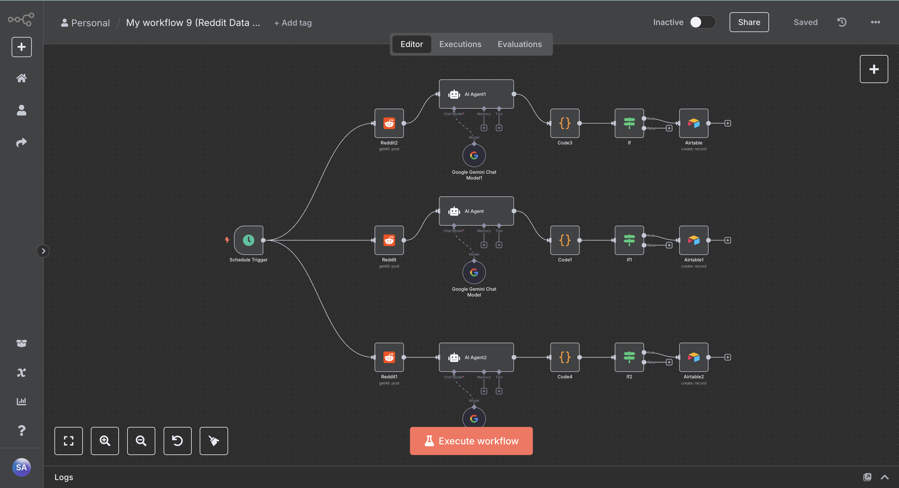

# n8n Reddit Data Scraper Workflow

This repository contains an n8n automation workflow designed to scrape and categorize Reddit posts from specified subreddits. It integrates Google Gemini for intelligent summarization and filters posts based on upvote ratios before storing the relevant content in Airtable for future analysis.

---

## Problem Statement

Tracking popular or high-quality Reddit posts across multiple subreddits manually is inefficient and time-consuming. This workflow automates the entire process—scraping, summarizing, filtering, and storing—making it easier for users to archive or analyze top Reddit content in a structured way.

---

## Features

- **Scheduled Scraping**  
  Automatically fetches new Reddit posts at set intervals.

- **Multi-Subreddit Support**  
  Configured to extract posts from `technology`, `finance`, and `ArtificialIntelligence` subreddits.

- **AI-Powered Summarization**  
  Uses Google Gemini to generate concise, one-line summaries for each post.

- **Upvote Ratio Filtering**  
  Filters posts to only process those with an upvote ratio above `0.93`, ensuring high-quality content is retained.

- **Airtable Integration**  
  Saves post metadata (title, author, score, upvote ratio, summary) into categorized Airtable bases.

---

## Workflow Overview

1. **Schedule Trigger**  
   Executes daily at a specific time (e.g., 11:00 AM) to begin scraping.

2. **Reddit Nodes**  
   Fetch the latest 3 "new" posts from the following subreddits:
   - `Technology`
   - `Finance`
   - `ArtificialIntelligence`

3. **AI Agent Nodes**  
   For each post, Google Gemini summarizes the content and filters based on the upvote ratio. Posts with ratios below `0.93` are flagged as `skip`.

4. **Code Nodes**  
   Parses and validates the AI-generated JSON output, resolving any formatting issues.

5. **If Nodes**  
   Checks the `skip` flag. Only posts with `skip: false` are passed to the next step.

6. **Airtable Nodes**  
   Creates records in relevant Airtable tables based on subreddit category with extracted fields.

---

## Setup Instructions

1. **Import the `workflow.json`** into your n8n instance.

2. **Configure Required Credentials**  
   Ensure the following integrations are correctly set up in your n8n environment:
   - Reddit OAuth2 API credentials  
   - Google Gemini (PaLM) API credentials  
   - Airtable Personal Access Token  

3. **Update Airtable Configuration**  
   The default setup uses:
   - **Base ID:** `appVHHKsatng2Tsle`
   - **Table IDs:**
     - Artificial Intelligence: `tbl3kAVn8kywaT8kf`
     - Tech: `tblgLpuWVk7MheR3B`
     - Finance: `tblGEZJtkkDJ5RDwM`

   Update these IDs in the Airtable nodes if your Airtable setup differs.

---

## Visual Overview

---

## Author

**Sanskar Awasthi**  
Email: [sanskarawasthi93@gmail.com](mailto:sanskarawasthi93@gmail.com)  
GitHub: [@sanskar-94](https://github.com/sanskar-94)  
Upwork: [https://www.upwork.com/freelancers/~015a6baf82356aebbe](https://www.upwork.com/freelancers/~015a6baf82356aebbe)

---

## Support

If this workflow saves you time or inspires improvements, consider starring the repository or reaching out for collaboration.
